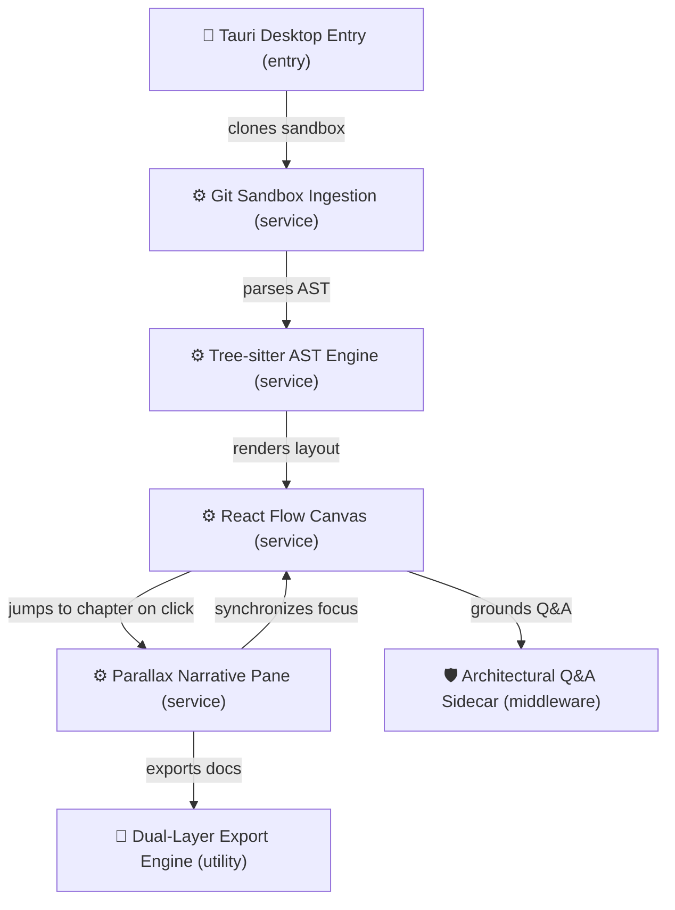

[](https://buzzcobain.github.io/RepoTale/)

# 🗺️ RepoTale Interactive Architecture: buzzcobain/RepoTale

> Interactive, local-first codebase storytelling & AST architecture visualizer

**Primary Language:** `TypeScript`  
**Frameworks & Libraries:** `Tauri v2`, `React 18`, `React Flow`, `Tree-sitter`, `Tailwind CSS`  
**Entrypoint:** `src/main.tsx`

## 📊 System Call Graph



## 📖 Chapter-by-Chapter Guided Walkthrough

<details>
<summary><b>Chapter 1: Sandboxed Git Ingestion & AST Extraction</b></summary>

> **Summary:** Shallow git cloning into isolated temporary directories and deterministic Tree-sitter parsing.

When a repository URL is ingested, RepoTale executes a sanitized shallow clone (`git clone --depth 1`) into an isolated temporary directory. The manifest sniffer reads dependencies, and Tree-sitter query cursors extract top-level symbols and call-sites before LLM prompting.

**Key Modules:** `main`, `GitSandbox`, `RepoAstParser`

#### 📄 `src-tauri/src/git.rs` (Lines 20-40)

_GitSandbox isolates repository files and validates URLs against shell injection._

```typescript
pub fn clone_repo(url: &str) -> Result<Self> {
    let sanitized_url = sanitize_git_url(url)?;
    let sandbox = Self::new()?;

    let status = Command::new("git")
        .arg("clone")
        .arg("--depth")
        .arg("1")
        .arg(&sanitized_url)
        .arg(&sandbox.path)
        .status()?;

    if !status.success() {
        let _ = sandbox.cleanup();
        return Err(anyhow!("Git clone failed"));
    }
    Ok(sandbox)
}
```

</details>

<details>
<summary><b>Chapter 2: Bidirectional Parallax Canvas & Camera Choreography</b></summary>

> **Summary:** Synchronizing scroll progress with React Flow camera animations and node click navigation.

The left pane uses an IntersectionObserver to monitor which chapter is currently in view. When a chapter enters the viewport, it pans and zooms the React Flow canvas to center the active subgraph. In reverse, clicking any node on the diagram immediately scrolls the left pane to the chapter explaining it.

**Key Modules:** `CodeGraphCanvas`, `NarrativePane`

#### 📄 `src/context/StoryContext.tsx` (Lines 70-95)

_selectNode finds the matching chapter and smoothly scrolls to it with a highlight pulse._

```typescript
const selectNode = (nodeId: string | null) => {
  setSelectedNodeId(nodeId);
  if (!nodeId) return;

  const targetChapterIdx = story.chapters.findIndex((chap) =>
    chap.activeNodes.includes(nodeId)
  );

  if (targetChapterIdx !== -1) {
    setActiveChapterIndex(targetChapterIdx);
    const card = document.getElementById(`chapter-card-${targetChapterIdx}`);
    card?.scrollIntoView({ behavior: 'smooth', block: 'start' });
  }
};
```

</details>

<details>
<summary><b>Chapter 3: Context-Grounded Q&A & Dual-Layer Export</b></summary>

> **Summary:** Zero-hallucination architectural queries and automated GitHub Pages exporter.

The Q&A sidecar grounds questions against the current chapter AST symbols, ensuring answers are hallucination-free. When ready to publish, the export engine generates native GitHub README additions with Mermaid diagrams and a standalone single-file HTML viewer for GitHub Pages.

**Key Modules:** `QASidecarDrawer`, `export_all`

#### 📄 `src-tauri/src/export.rs` (Lines 258-285)

_export_all updates README.md, generates /docs/index.html, and pushes the branch via Git/SSH._

```typescript
pub fn export_all(payload: &ExportPayload) -> Result<ExportResult> {
    let readme_addition = generate_markdown_readme(&payload.story_json, github_user, repo_name)?;
    let static_html = generate_standalone_html(&payload.story_json);
    fs::write(docs_dir.join("index.html"), &static_html)?;

    if payload.create_git_branch {
        Command::new("git").args(["checkout", "-B", branch]).status()?;
        Command::new("git").args(["add", "README.md", "docs/index.html"]).status()?;
        Command::new("git").args(["commit", "-m", "docs: add RepoTale guide"]).status()?;
        Command::new("git").args(["push", "-u", "origin", branch]).status()?;
    }
}
```

</details>

---
*Generated by [RepoTale](https://repotale.com) — Open-source interactive codebase storytelling.*